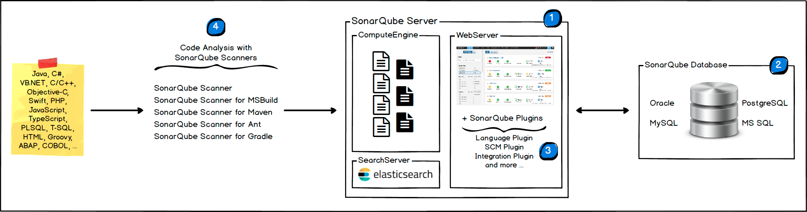

# Demo Sonar Cloud

SonarQube met eigen server
--------------------------
*1. SonarQube architectuur*
SonarQube bestaat uit drie belangrijke onderdelen:
- SonarQube source en web server
- de database
- de analysers 
De analysers analyseren de source code en werken de database bij. Vervolgens worden de resultaten van de analyse
mooi weergegeven in de web console.

    
*2. Database installatie*
Voor SonarQube heb je een database nodig, waar SonarQuba alle resultaten op kan slaan die de analyseres genereren.

*3. Server and SonarQube installatie*
De volgende stap is het installeren van een web server. De webserver verbindt de database met SonarQube. Hiervoor
moet je de juiste database connectie string uitcommentariëren in de `sonar.properties` file in the `conf` folder aanpassen.
Als de webserver start krijg je de web console te zien.

*4. Analysers*
- De analysers zijn de brug tussen de code die je wilt analyseren en de SonarQube database. Er zijn verschillende analysers beschikbaar.
Deze scanner moet je downloaden en in je SonarQube plaatsen. 
- Daarna moet deze configureren via de `sonar-runner.properties` file in the `/conf` folder.
- De inhoud van de `sonar-runner.properties`  file moet gelijk zijn aan de `sonar.properties` file.
- daarna moet je een  environment variabele SONAR_RUNNER_HOME maken die wijst naar deze folder.
- /bin directory toevoegen aan jouw path variable.
- `Runner` is de oude naam voor `Scanner`.

5. Analyseer het project
- maak een `sonar- project.properties` file aan en plaatste deze in je projectmap.
- start de sonar-scanner
- als het gelukt is zijn de resultaten opgeslagen in de database en kun je deze inzien via de web interface.

SonarQube with SonarCloud
-------------------------

